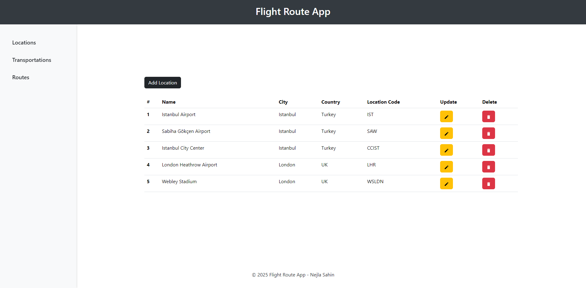
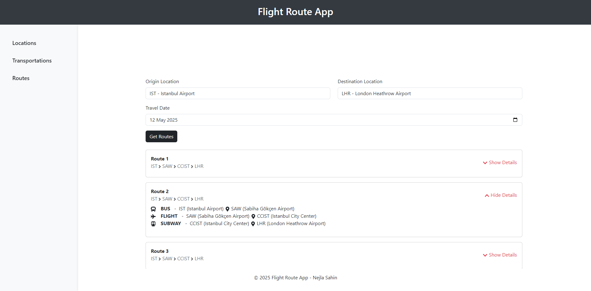

# ✈️ Flight Route App

A web application that manages locations and calculates the most suitable transportation route between them. Built with Java Spring Boot (backend) and React (frontend).

## 🧩 Project Structure

```
flight-route-app/
├── flight-route-service/ # Java Spring Boot application
└── flight-route-ui/ # React application
```

## 🚀 Features

- Create, list, update and delete locations
- Add and update transportation links between locations
- Calculate the optimal route between two locations
- Supports filtering routes based on operating days of transportations if a date is provided
- REST APIs with Swagger documentation
- Unit and integration tests

## ⚙️ Technologies

### Backend
- Java 17
- Spring Boot
- Spring Data JPA
- H2 Database
- Swagger (OpenAPI)
- JUnit, Mockito, Spring Boot Test

### Frontend
- React
- Axios
- React Router
- Bootstrap

## 📦 Getting Started

### Option 1: Run Backend + Frontend Together

```bash
cd flight-route-service

mvn spring-boot:run -Pbuild-frontend
```

Backend & Frontend available at: http://localhost:8080

### Option 2: Run Backend and Frontend Separately

#### 🔧 Backend Only
```bash
cd flight-route-service

mvn spring-boot:run
```
Backend runs at: http://localhost:8080

#### 🌐 Frontend Only
```bash
cd flight-route-ui

npm install

npm start
```

Frontend served at: http://localhost:3000

## 📄 API Documentation
Accessible via Swagger UI:
http://localhost:8080/swagger-ui/index.html


## 🖼️ Screenshots

### 📍 Locations Page


### 🛣️ Transportations Page


### ✈️ Routes Page with Valid Route Listings


## 📫 Postman Collection

You can import the Postman collection to test all available endpoints easily:

### 📥 [Download Postman Collection](docs/Flight_Route_App.postman_collection.json)

## 📝 License
### MIT License

Copyright (c) 2025 Nejla Sahin

Permission is hereby granted, free of charge, to any person obtaining a copy
of this software and associated documentation files (the "Software"), to deal
in the Software without restriction, including without limitation the rights
to use, copy, modify, merge, publish, distribute, sublicense, and/or sell
copies of the Software, and to permit persons to whom the Software is
furnished to do so, subject to the following conditions:

The above copyright notice and this permission notice shall be included in all
copies or substantial portions of the Software.

THE SOFTWARE IS PROVIDED "AS IS", WITHOUT WARRANTY OF ANY KIND, EXPRESS OR
IMPLIED, INCLUDING BUT NOT LIMITED TO THE WARRANTIES OF MERCHANTABILITY,
FITNESS FOR A PARTICULAR PURPOSE AND NONINFRINGEMENT. IN NO EVENT SHALL THE
AUTHORS OR COPYRIGHT HOLDERS BE LIABLE FOR ANY CLAIM, DAMAGES OR OTHER
LIABILITY, WHETHER IN AN ACTION OF CONTRACT, TORT OR OTHERWISE, ARISING FROM,
OUT OF OR IN CONNECTION WITH THE SOFTWARE OR THE USE OR OTHER DEALINGS IN THE
SOFTWARE.